# Windows Endpoint Incident Response

## Overview

This repository documents a complete Windows Endpoint Incident Response investigation involving malware detection, persistence hunting, system remediation, and post-incident validation.

## Incident

Trojan.FakeChrome
PUP.Optional.DriverPack

## Skills Demonstrated

- Malware Investigation
- Endpoint Detection
- Persistence Hunting
- Windows Registry Analysis
- Scheduled Task Analysis
- Microsoft Defender Validation
- Malwarebytes Investigation
- Windows System Repair
- MITRE ATT&CK Mapping
- Incident Documentation

## Repository Structure

Incident-Report/
Detection-Logic/
Evidence/
Screenshots/

## Tools Used

- Malwarebytes
- Microsoft Defender
- PowerShell
- DISM
- SFC
- Registry Editor
- Task Scheduler

## MITRE ATT&CK

Tactic and technique mapping available under Detection-Logic.

| Technique | ID |
|---|---|
| PowerShell | T1059.001 |
| Process Discovery | T1057 |
| File and Directory Discovery | T1083 |
| Network Service Scanning | T1046 |

---

## Skills Demonstrated

- Windows Endpoint Investigation
- Digital Forensics Fundamentals
- Threat Detection
- Incident Response Documentation
- MITRE ATT&CK Mapping
- SOC Analyst Workflow

----

## Investigation Screenshots

### Malwarebytes Detection

Threat Scan Summary

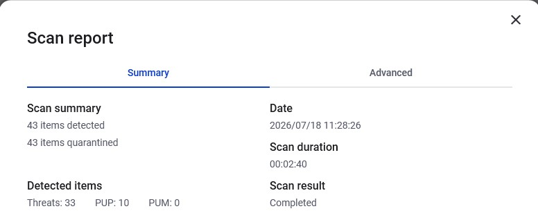

Detected Threats

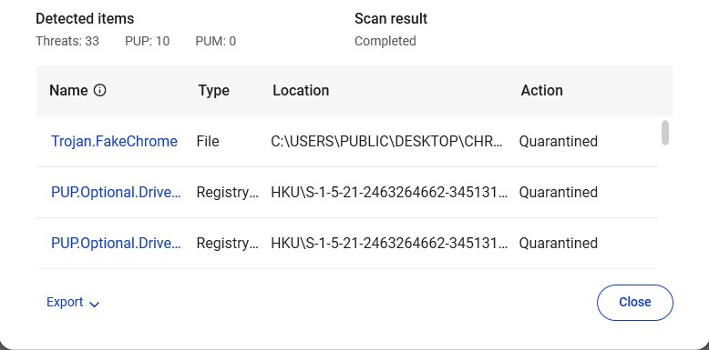

Threats Quarantined

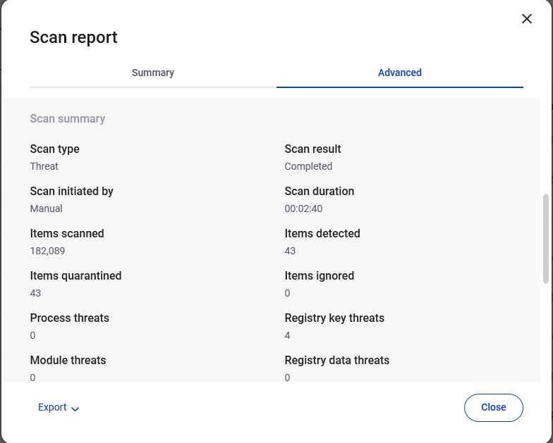

---

### Microsoft Defender Validation

Windows Security Dashboard

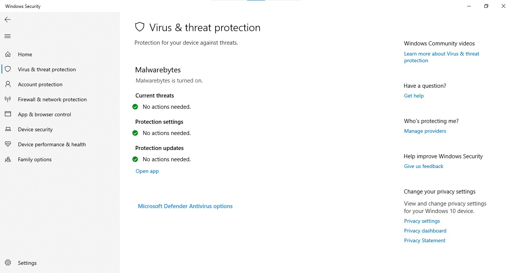

Defender Status (PowerShell)

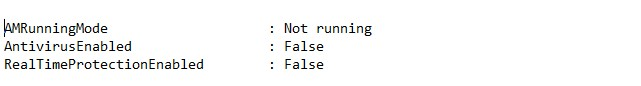

Defender Service

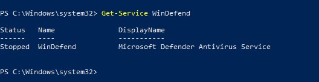

---

### PowerShell Investigation

Startup Registry Review

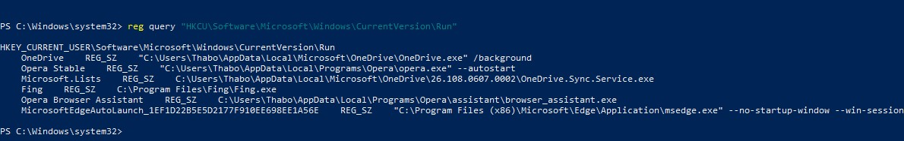

Scheduled Tasks Review

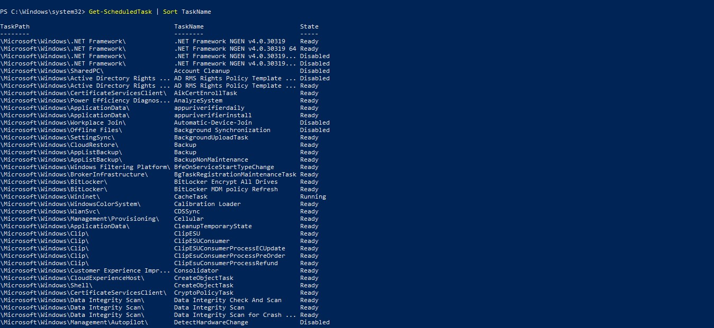

Registered Antivirus Products

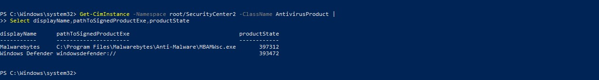

Service Events

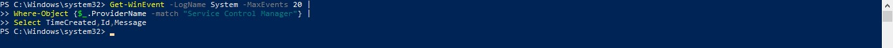

---

### Windows System Repair

DISM Repair

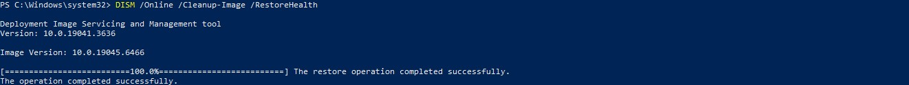

SFC Validation

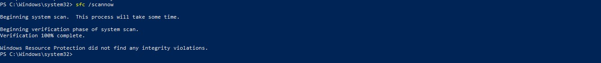

---

### Recovery

Restore Point Created

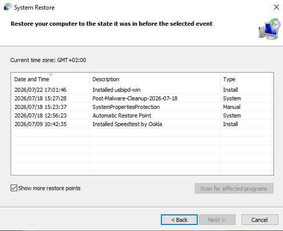

System Protection

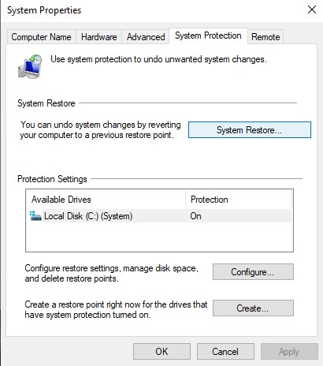

----

# Author

**Thabo Sakonta**

Microsoft Certified Security Operations Analyst (SC-200)

LinkedIn

https://www.linkedin.com/in/thabo-sakonta-377a3748

GitHub

https://github.com/thabosakonta-wq

---

# License

Educational and portfolio purposes.
