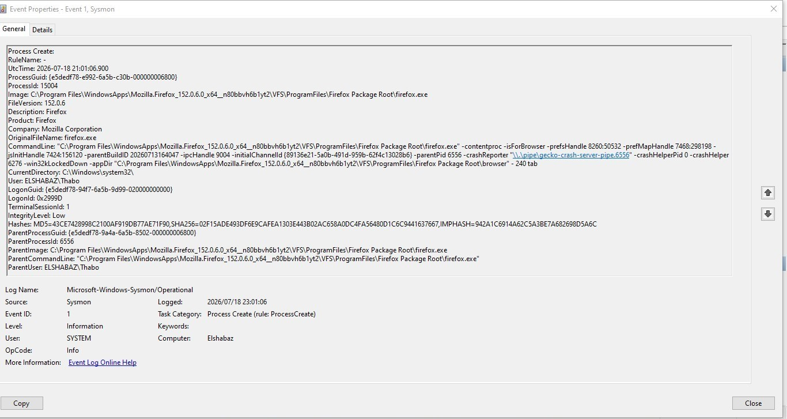
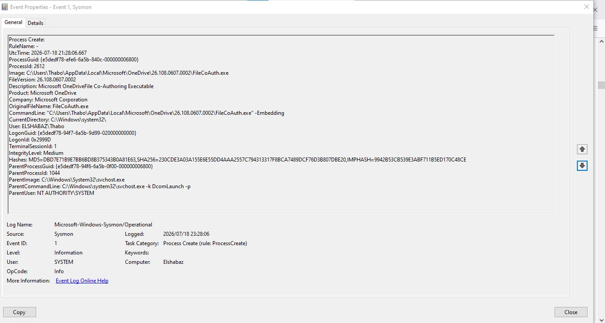

# Windows Endpoint Incident Response Lab

## Overview

This project demonstrates a practical Security Operations Center (SOC) incident response workflow focused on investigating and responding to suspicious activity on a Windows endpoint.

The lab simulates a real-world security incident involving suspicious PowerShell execution, endpoint investigation, evidence collection, detection logic development, and remediation.

---

## Incident Scenario

A security alert was generated after unusual PowerShell activity was detected on a Windows workstation.

The SOC analyst was responsible for:

- Validating the alert
- Investigating endpoint activity
- Reviewing Windows event logs
- Analysing suspicious processes
- Identifying indicators of compromise (IOCs)
- Mapping attacker behaviour to MITRE ATT&CK
- Documenting containment and recovery actions

---

## Investigation Objectives

- Determine whether malicious activity occurred
- Identify affected systems and processes
- Collect forensic evidence
- Analyse attacker techniques
- Develop detection logic
- Document incident response actions

---

## Tools Used

### Endpoint Analysis

- Windows Event Viewer
- PowerShell Logs
- Sysmon
- Microsoft Defender

### Network Analysis

- Wireshark
- Nmap
- TCP/IP analysis

### Threat Detection

- Microsoft Sentinel
- KQL
- Sigma Rules
- MITRE ATT&CK Framework

### Documentation

- Incident Response Reports
- Evidence Collection
- Investigation Timeline

---

## Incident Response Process

The investigation follows the standard incident response lifecycle:

1. Preparation
2. Identification
3. Containment
4. Eradication
5. Recovery
6. Lessons Learned

---

## Repository Structure

---

## MITRE ATT&CK Techniques Covered

| Technique | ID |
|---|---|
| PowerShell | T1059.001 |
| Process Discovery | T1057 |
| File and Directory Discovery | T1083 |
| Network Service Scanning | T1046 |

---

## Skills Demonstrated

- Windows Endpoint Investigation
- Digital Forensics Fundamentals
- Threat Detection
- Incident Response Documentation
- MITRE ATT&CK Mapping
- SOC Analyst Workflow

----

## Investigation Screenshots

### Windows Event Investigation


### Sysmon Process Analysis


----

## Microsoft Sentinel Detection Engineering

The investigation was extended into Microsoft Sentinel using KQL detection logic.

Implemented detections:

- Suspicious PowerShell execution
- Failed login detection
- Process creation monitoring
- Threat hunting queries

Example KQL Detection:

```kql
SecurityEvent
| where EventID == 4688
| where CommandLine contains "powershell"
| project TimeGenerated, Computer, Account, CommandLine

----

### Detection Mapping

| Detection | MITRE ATT&CK |
|---|---|
| Suspicious PowerShell | T1059.001 |
| Process Creation | T1057 |
| Failed Authentication | T1110 |

----

## Sysmon Endpoint Monitoring

Sysmon was deployed on the Windows endpoint to collect detailed security telemetry.

Collected evidence includes:

- Process creation monitoring (Event ID 1)
- Parent-child process relationships
- Command-line analysis
- SHA256 file hashes
- User and integrity level analysis

Example investigation:

A Firefox process creation event was captured using Sysmon Event ID 1 and analysed through Windows Event Viewer.

Evidence location:

----

MITRE ATT&CK mapping:

- T1059 - Command and Scripting Interpreter
- T1106 - Native API

----

## Evidence Screenshots

### Sysmon Event ID 1 - Process Creation



### Sysmon Process Creation Investigation



----

# Author

**Thabo Sakonta**

Microsoft Certified Security Operations Analyst (SC-200)

LinkedIn

https://www.linkedin.com/in/thabo-sakonta-377a3748

GitHub

https://github.com/thabosakonta-wq

---

# License

Educational and portfolio purposes.
